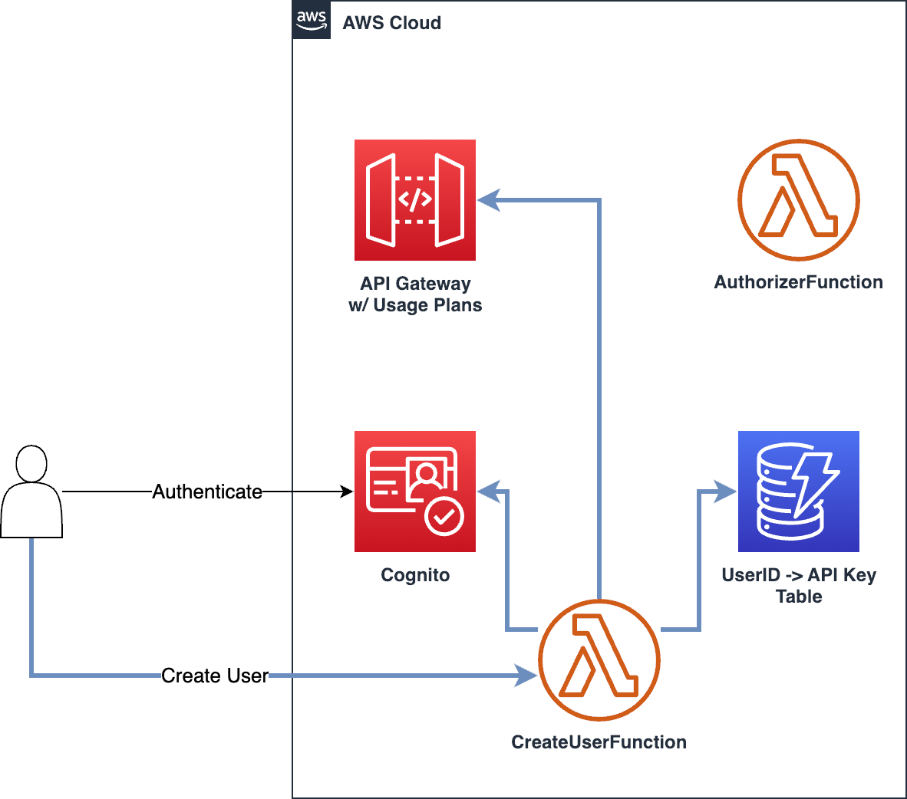
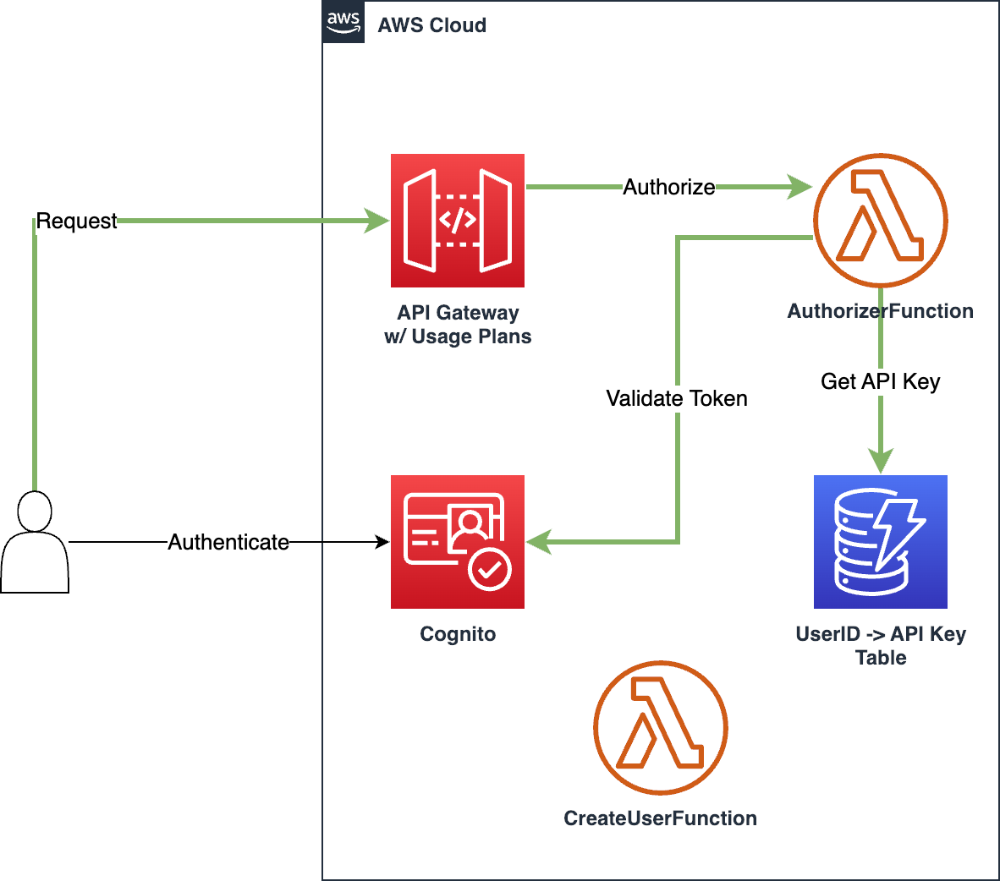
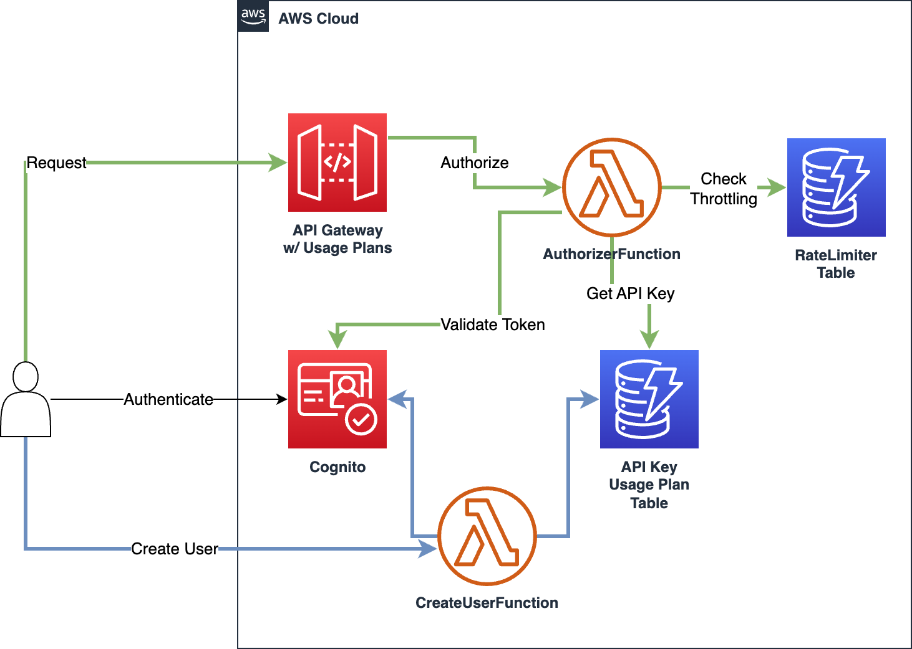

# Large Scale API Throttling

This repository contains two sample projects with reference implementations of
two ways to do API request throttling in Amazon API Gateway.

Both of these projects are for meant for illustration purposes only.
You can find them in `./api-throttling-usage-plans` and
`./api-throttling-fixed-window`.

## Common parts

- Both projects are written as AWS SAM templates

- Both samples deal with situations where the end-user does not explicitly send
  their API key in the HTTP headers. Management of API keys is done
  server-side, based on user identity provided by Amazon Cognito

- User creation is done through a Lambda function invocation for illustration.
  This is due to the added complexity of maintaining user to API key mappings.

## How to run

Simply navigate into a sample subdirectory and run:

```
sam build
sam deploy --guided
```

To delete the stack, run:

```
sam delete
```


## API throttling with Usage Plans

This architecture uses API Gateway's Usage Plan functionality for throttling.

The following diagram shows the user creation flow:



Here, CreateUserFunction is tasked with creating a user in Cognito, generating
a new API key for them, registering the API key with API Gateway's Usage Plans,
and finally, storing the user identity mapping onto the generated API key in
DynamoDB.

The following diagram shows the authorization part of the flow:



The authorizer function gets the access token from the headers and checks it
with Cognito. Upon successful token validation, authorizer looks up the API key
for the user in DynamoDB and returns it in the `usageIdentifierKey` property of
the policy document. The API key is then used by API Gateway to apply Usage
Plan throttling policies on the request.

### Considerations

This solution caps at 10000 API keys total. To remove this limitation, we need
to add a custom rate limiter system and track our own API keys:

## API throttling using a custom fixed-window rate limiter

This architecture applies throttling within a custom authorizer Lambda
function. It uses a DynamoDB table for storing user-API key mappings. 



In this sample we show a very rudimentary fixed-window rate limiter built on
top of DynamoDB. The rate limiter itself is not too interesting. Rather we want
to show a reference of how one can use custom authorizers for throttling
purposes.

The flow is very similar to the first example, except for the added DynamoDB
table to store the request counts per user and per window.

### Considerations

- This solution assigns simple throttling policy documents to users. It does
  not offer a way to manage these at scale. In order to do this, one could add
  Usage Plans as first order constructs and add a level of indirection from the
  user table. Since the Usage Plans would not be expected to change frequently,
  a mapping from Usage Plan ID to the throttling policy could be cached within
  the Lambda context.
- The rate limiter implementation uses the combination of API key and current
  time window as keys. This means that for every new window of time, a new
  record is created per user accessing the system. To avoid inflated storage
  costs, we clean up with an aggressive TTL policy set for the start of the
  next window.
